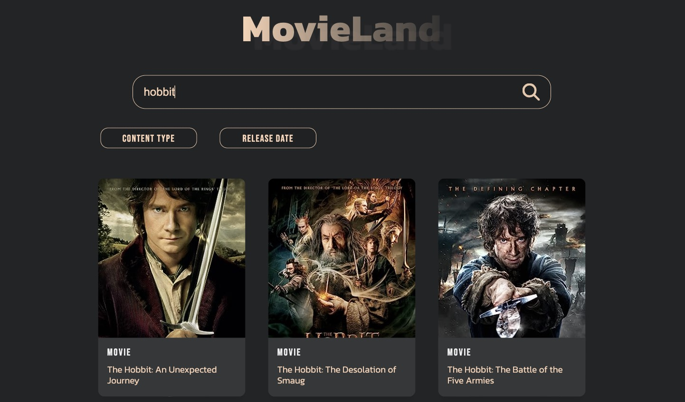

# JavaScript Mastery - React Movie App

This is a website built following Adrian's tutorial. He published a video on his YouTube channel, [JavaScript Mastery](https://www.youtube.com/@javascriptmastery), teaching how to build a React app. Thanks to him, it was really helpful!

## Table of contents

- [Overview](#overview)
  - [The tutorial](#the-tutorial)
  - [Screenshot](#screenshot)
  - [Links](#links)
- [My process](#my-process)
  - [Built with](#built-with)
  - [What I learned](#what-i-learned)
  - [Customization](#customization)
- [Author](#author)

## Overview

### The tutorial

In his 1h video course, Adrian starts by teaching you React's most important concepts. Then, time to practice! You are invited to code along while he's showing you how to create a basic movie website. 

**The video is organized in 3 parts:**

 1. Overview
 2. React in Practice
 3. Developing a Project

### Screenshot

### Links

- Tutorial URL: [React JS Full Course 2023 | Build an App and Master React in 1 Hour](https://www.youtube.com/watch?v=b9eMGE7QtTk)
- Live Site URL: [Live Movie Website](https://leo-code-ca.github.io/first-react-movie-app/)

## My process

### Built with

- CSS custom properties 
- BEM (at least I tried!)
- React JS

### What I learned

It's actually my first ever React project! I'm so, so happy of it! It's probably one of the projects that taught me the most but also one of the projects that made me struggle the most!!

Before starting this tutorial, I already had a basic understanding of React as I went through most of their documentation and I also completed FreeCodeCamp's and W3School's courses. However, I had never built something with that knowledge! 

Following the tutorial was actually pretty easy and I understood most of Adrian's explanations. The true problems started when I decided that the project was looking good but... I wanted to add a few features to it. At this point, alone facing my code, I spent hours and hours trying to figure out how to create what I wanted, to finally find out barely acceptable solutions. Frustrating but, part of the learning process I guess! 

To be honest, I spent days on this project. Globally, I'm satisfied of it (for a first project) and most important... I can't wait to learn and build more with React! It looks to be so powerful!

Let's list what I've learned during this project: 

 - Use React on VS Code 
 - Create a React environment 
 - React concepts (components, states, props)
 - Fetch API
 - Loop over arrays to create list elements 
 - Dynamic search bar with suggestions
 - Buttons that allow filtering 

### Customization

When I was done with the tutorial, I was so eager that add many functionalities to the app, to make it look closer from "those true apps out there"! 

My expectations quickly faded out when I understood the actual complexity of what I wanted to implement! However, I didn't give up! I did less than what I hoped but I still did something, decent, I think!

Let’s list the main changes I made to the project:

 - Add a dropdown to the search bar
 - Make the search bar dynamic by showing suggestions 
 - Add filter buttons
 - Add a dropdown with options for filtering 
 - Different color for the active item 
 - Add more media-queries for responsiveness
 - Slightly modify the design  
## Author

- GitHub - [@Leo-Code-CA](https://github.com/Leo-Code-CA)
- FreeCodeCamp - [@Leo-code](https://www.freecodecamp.org/Leo-code)